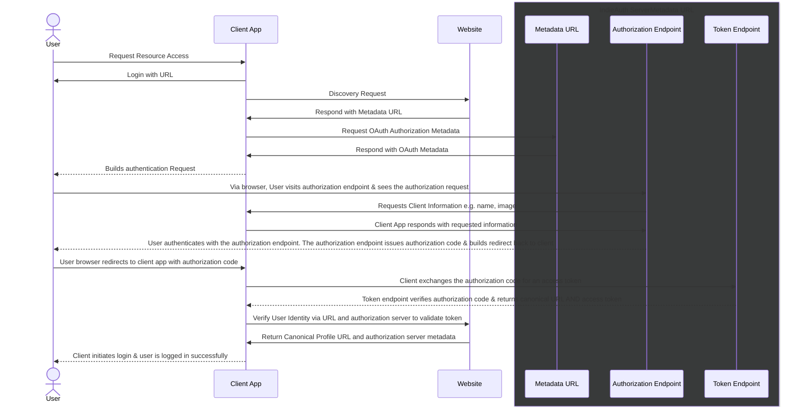

Suppose you want to authenticate with an application for <insert examples here>. 

IndieAuth is an extension of OAuth 2.0. It's implementation differs from OIDC or other common OAuth Authorization Code Flows in that IndieAuth requires using your URL as your identifier, rather than relying on a social provider to manage your id, or require maintaining a self-hosted IAM solution. 

Below is an example if you wanted to use a micropub client app for <insert reasons>

