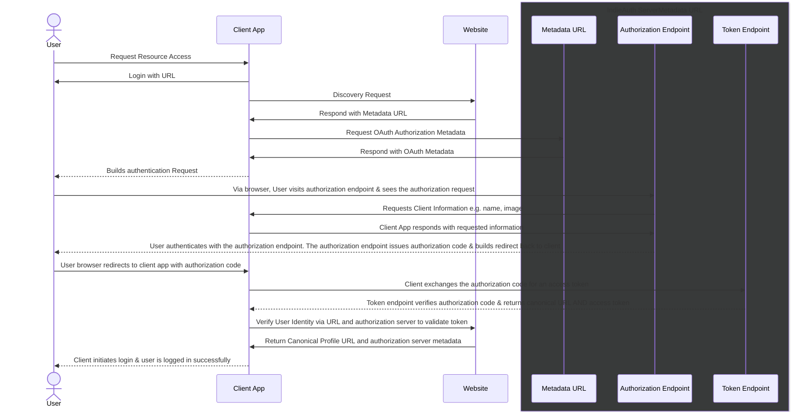

Suppose you want to authenticate with an application gain authorization to leave a comment on a website, be granted write access, grant limited api access, or any number of reasons users would want to authenicate. Depending on needs, a popular option is to implement OAuth 2.0 with a popular 3rd party like Google or Facebook. Given unique requirements, a development team can even roll their Identity Provider Server (as would be the case in an enterprise solution). OAuth typically works by granting the user an access token, issued by authorization server. Most netizens would encounter this is the form of relying on a centralized authorization server maintained by Google, Facebook, etc, which would be responsible for authenicating a user, and granting authorization to a 3rd party app on the user's behalf. However this is not the only solution. For users of the fediverse and specifically the indie web, a decentralized OAuth implementation exists, aptly called IndieAuth.

IndieAuth is an extension of OAuth 2.0. It's implementation differs from OIDC or OAuth Authorization Code Flows in that IndieAuth requires using a website as your identifier, rather than relying on a social provider to manage your id, or require maintaining a self-hosted IAM solution. This has the advantage of creating some federation of your true online identity. It's not you on Twitter, or you on Facebook; it's you as you as identified by your website.

Below is an example if you wanted to use a micropub client app for <insert reasons>

To compare OAuth Authorization Grant with IndieAuth flows

| | OAuth 2.0 Auth Grant | IndieAuth |
| -- | -- | --| 
| | 1. Client app redirects user to auth server | 1. User enters website for authentication
| | 2. User logs in and grants permission | 2. Client app fetches website and discovers user defined auth endpoint |
| | 3. Auth server grants an authorization code | 3. User authenticates via their defined auth endpoint |
| | 4. client app exchanges auth code for access token | 4. authorization server grants an authorization code | 
| | 5. User is able to access protected resources with access token | 5. client app exchanges auth code for access token | 
| |  | 6. User is able to access protected resources with access token |
